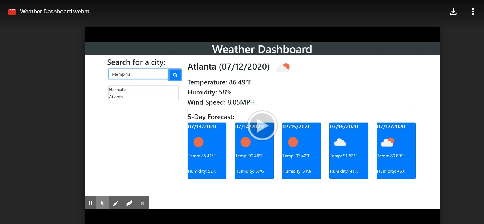

# Weather Dashboard

[LINK TO APPLICATION](https://cjacktwil.github.io/weather-dashboard/)

## Description

This weather dashboard provides current conditions and a 5-day forecast for the city of a user's choice. 

## Functionality

When a user opens the application, he/she sees a search box. Upon entering the name of a city, that city's current conditions appear to the right. Below current conditions, the user will see the city's 5-day forecast (as of 3 p.m. of a given day, local time). Any city searched will appear below the search box. If the user clicks on one of the cities already searched, that city's current conditions and forecast will repopulate. 
